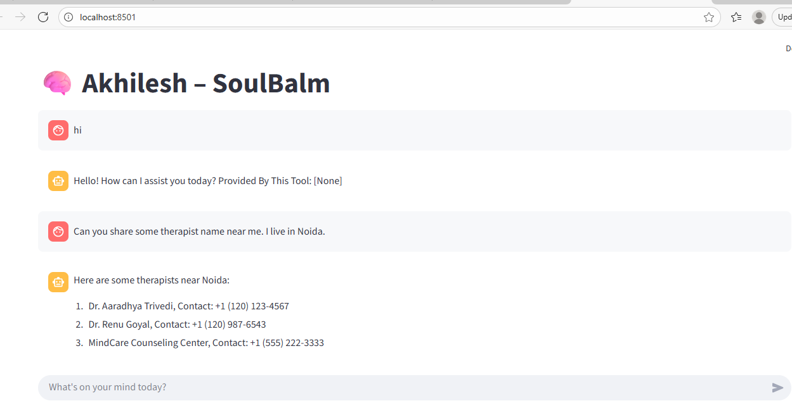

### 🌿 Introducing SoulBalm – An AI Mental Health Therapist

### I’m truly excited to share my latest project — SoulBalm, an AI-powered mental health assistant designed to support, guide, and provide compassionate conversations for those who need it.

### What sets SoulBalm apart?
### ✅ RAG (Retrieval-Augmented Generation) for accurate, context-aware responses
### ✅ LangChain + LangGraph for orchestrating thoughtful multi-step reasoning
### ✅ LangSmith for monitoring and refining conversations
### ✅ VectorDB (Pinecone) for secure, semantic memory storage
### ✅ Integrated Tools – 📧 SendGrid for communication and 🌐 DuckDuckGo for real-time knowledge retrieval
### ✅ LLM (OpenAI) at the core, enabling natural, empathetic interaction

### 💡 The Vision:
### Mental health is deeply personal. SoulBalm isn’t meant to replace human therapists, but to provide an always-available, non-judgmental companion that can listen, guide, and gently point users toward helpful resources.

### For me, building SoulBalm has been more than just a technical challenge — it’s about exploring how AI can serve humanity in meaningful, responsible ways.

### ✨ This is just the beginning. Next steps include expanding its emotional intelligence, integrating multilingual support, and collaborating with experts to ensure ethical, safe deployment.



### STEP 00- Clone the repository

https://github.com/akhileshtrivedi/Medical-Chatbot-Pinecone.git

### STEP 01- Create a virtual environment after opening the repository

```bash
uv venv .venv
```

```bash
.\.venv\Scripts\activate 
```


### STEP 02- install the requirements
```bash
pip install -r requirements.txt
```


### Create a `.env` file in the root directory and add your Pinecone & openai credentials as follows:

```ini
OPENAI_API_KEY = "xxxxxxxxxxxxxxxxxxxxxxxxxxxxx"
```


```bash
# run the following command
uv run backend/main.py 
```

```bash
# Finally run the following command
uv run streamlit run frontend.py
```
Now,
```bash
open up localhost:
```

### Thanks