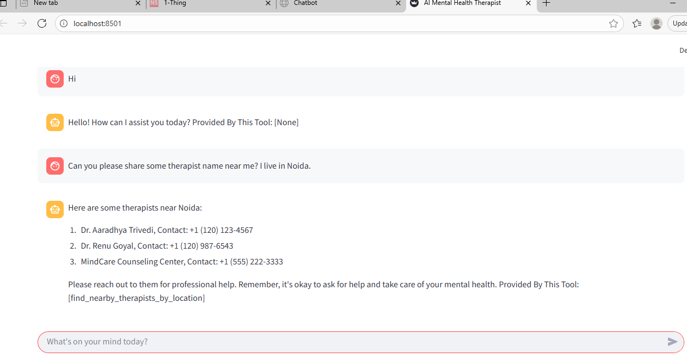

### STEP 00- Clone the repository

https://github.com/akhileshtrivedi/ai-therapist.git

### STEP 01- Create a virtual environment after opening the repository

```bash
uv venv .venv
```

```bash
.\.venv\Scripts\activate 
```


### STEP 02- install the requirements
```bash
pip install -r requirements.txt
```


### Create a `.env` file in the root directory and add your Pinecone & openai credentials as follows:

```ini
OPENAI_API_KEY = "xxxxxxxxxxxxxxxxxxxxxxxxxxxxx"
```


```bash
# run the following command
uv run backend/main.py 
```

```bash
# Finally run the following command
uv run streamlit run frontend.py
```
Now,
```bash
open up localhost:
```

### Thanks